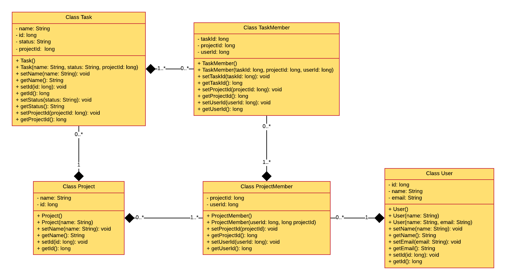
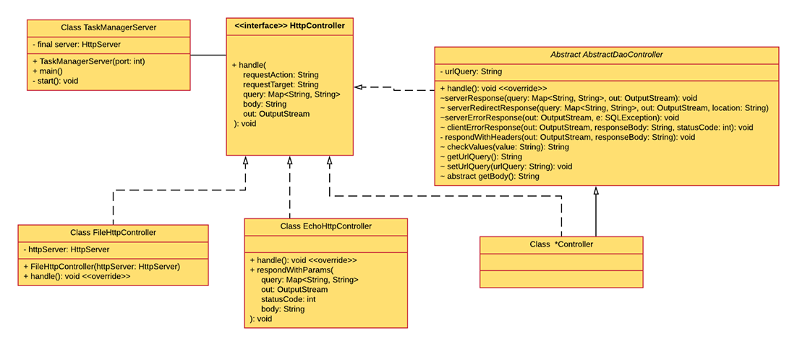

# Java Exam for the sophisticated

Alternativ Travis Link: https://travis-ci.com/Westerdals/pgr203-2019-eksamen-SeventhDisaster

This project was made as a pair-programming exam by: Krister Emanuelsen (SeventhDisaster) and Tommy Hamarsnes (tommyhama95) 
## Hvordan kjøre dette programmet

### Bygg og test executable jar-fil

1. Kjør `mvn clean` først for å rense /target, deretter kjør `mvn package` for å opprette .jar filen som skal kjøres.
2. Konfigurasjonsfilen må hete `task-manager.properties` og må inneholde følgende:
    * `dataSource.url = jdbc:postgresql://localhost:5432/` + og navnet på din database.
    * `dataSource.username = ` brukernavn til database-eier.
    * `dataSource.password = ` passord til brukeren.
3. Etter du har kjørt `mvn package` kan du kjøre serveren fra target undermappen ved å benytte: `java -jar target/task-manager-1.0-SNAPSHOT.jar`
    - Dersom dette ikke går, pass på at navnet på jar filen stemmer innenfor /target mappen.

### Funksjonalitet

1. Programmet kan interageres med i nettleser ved å besøke http://localhost:8080
2. Dersom du skriver `/echo?` etter url'en vil du kunne utføre generelle Echo forespørsler mot serveren, slik du kan på steder som URLecho.
3. Ved å trykke på `Add/Create new x` knappene på nettsiden, vil du kunne fylle inn skjemaer for å legge til nye elementer i databasen.
4. Når du trykker på lenkene til hver bruker, blir du tatt til et skjema der du får muligheten til å `endre navn og epost til bruker`.
5. Du kan besøke prosjekter ved å trykke på lenkene. Her har du muligheten til å `Endre på prosjektnavnet`, `Legge til nye oppgaver` og også `Legge til nye prosjektmedlemmer til prosjektet du er inni`
6. Ved å trykke på brukere **som er en del av prosjektet** vil du kunne `filtrere prosjektoppgaver` på brukeren du velger.
7. Ved å trykke på oppgavene i prosjektet vil du bli tatt til en detaljeside om oppgaven. Der vil du se `Oppgavestatus`, `Tildelte medlemmer` og `Mulighet til å endre på oppgavenavn`
8. Du kan trykke på oppgavestatusen for å `endre på oppgavestatus fritt`
9. Innlegg til databasen via POST requests vil også re-directe deg tilbake til den mest relevante siden.
10. Alle `tilbake` lenker tar deg tilbake til forrige ledd i prosessen

## Designbeskrivelse

#### Datamodel

#### HTTPServer Diagram

## Egenevaluering
 Vi føler at vi har hatt ett veldig godt samarbeid med denne eksamen fra start til slutt. Vi har jobbet med alt av kode når vi har vært fysisk til stede med den andre og meste parten av debugging og slutt prosessen har vært alene, men har hatt kommunikasjon på nett konstant.

### Hva vi lærte underveis
Vi føler at vi har fått en bedre forståelse for hvordan en webserver kommuniserer med databaser, og et mye 
sterkere grep på hvordan servere og klienter kommuniserer via bytestream. Ettersom oppgaven er praktisk bidro
det ganske mye for å bli kjent med bruk av GET og POST metoder innenfor HTTP, og også fått god forståelse av hvordan 
URL-Encoding fungerer.

I tillegg fikk vi mer øving og praksis i det å generalisere kodebasen for å gjenbruke kode effektivt og det å programmere parvis.

### Hva vi fikk til bra i koden vår
Vi føler at vi klarte å gjøre selve koden relativt modulær. Vi føler vi har en god struktur av gjenrbuk i koden som gjør at vi ikke skaper mye ikke-dry kode.
Vi mener vi har en god oversikt over navngiving av kode, som gjør bruk og hensikt av metoder og variabler selvforklarende nok.

Datamodellen våres føler vi er god med relevante biter som hører til der de behøves. Relasjonene har en relevant knyting til hverandre. 

### Hva vi skulle ønske vi hadde gjort annerledes
- Vært flinkere på å skrive kommentarer underveis.
- Testet koden underverveis oftere under utviklingen.
- Vurdert å ha ryddigere filstruktur tidligere i utviklingen.
- Det er sikkert mange flere ting vi kunne gjort bedre i utviklingen, men ettersom dette er første gang vi utvikler en slik løsning, og på denne skalaen, er det vanskelig å tenke på videre forbedringer eller avanserte løsninger, annet enn de punktene for ekstrapoeng vi ikke møtte krav til.

## Evaluering fra annen gruppe
https://github.com/Westerdals/pgr203-2019-eksamen-SeventhDisaster/issues

## Evaluering gitt til annen gruppe

