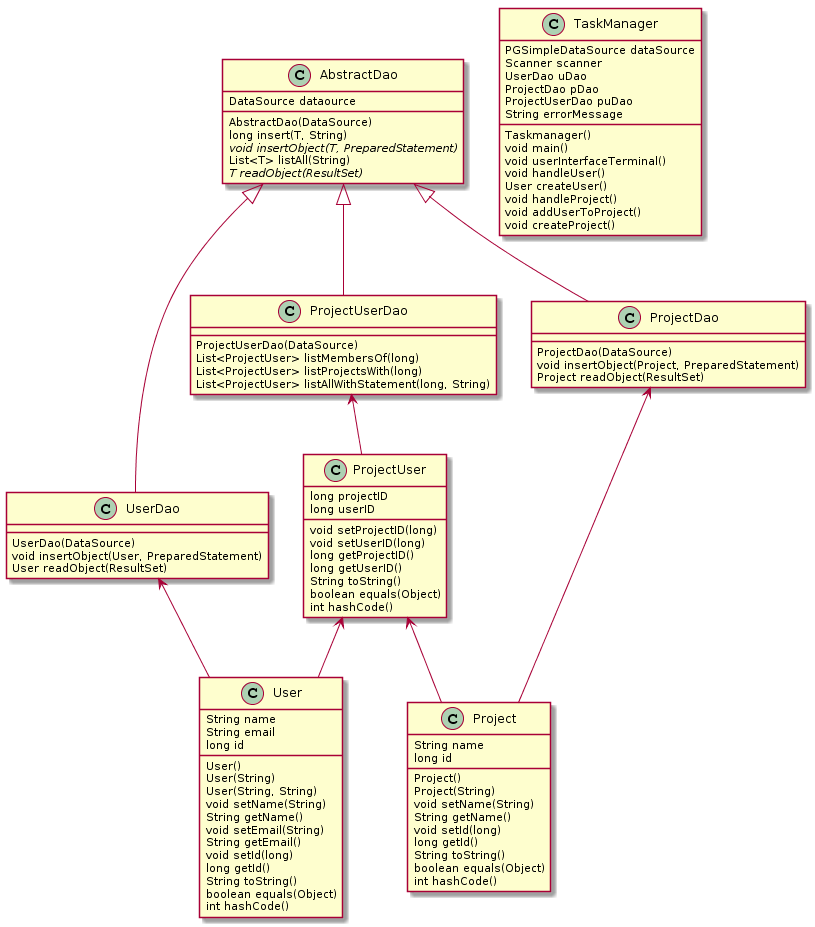

# JDBC For Dummies

We are dummies #TODO - Write stuff

## Usage
This project is built on `JDK 11.0.4`

It runs on a JDBC where details are provided from a `task-manager.properties` file.
The database should be called `taskmanager`
1. Before building the project, it's advised to run `mvn clean`, Then to build the project, run: `mvn package shade:shade`.
2. In order to run the jar file, run `java -jar target/task-manager-1.0-SNAPSHOT-shaded.jar`
3. To create a project along with a new user, follow the program's instructions in the terminal. You can either start by creating the user, then creating a project and adding an existing user to it. Or you can start by creating a project and assigning a newly created user to it right away.
4. This version of the program does not currently have tasks implemented.
5. This version of the program does not currently have any HTTP connectivity.
 
 ## Design (valgfritt)
 

 ## Implementation notes
 
We felt as if our implementation was well done specifically thanks to our successful many-to-many database connection. We are unfortunately still missing tasks and http conectivity, but this will be accounted for during the exam.

We specifically did not manage to implement `JOIN` queries for our database. The cause of this was likely the fact that we don't know how to create objects based on the resultset given from the query.

## Link to review

* link to issue you registered in other group's github repository
